# Train-free VrdONE 与 Agent 视频关系理解施工计划

_VIDVRD 大创项目正式施工文档 · 2026-08-27_

---

## 📋 方案结论

### 主线定位

项目主线固定为：

> **Rex-Omni + 官方 OC-SORT 核心 + 冻结 MEGA 特征提取器 + 冻结 VrdONE 关系专家 + 有界 Qwen Agent。**

整条主线不执行梯度训练，不训练检测器、跟踪器、MEGA、VrdONE 或千问。项目工作集中在模型接线、轨迹与特征适配、关系流程编排、风险路由和 Agent 主动取证。

### 固定决策

| 事项 | 决策 |
|---|---|
| 项目类型 | train-free 大创系统，不以论文复现或 SOTA 为完成条件 |
| `run_mode` | 仍只保留 `reference_dense` 与 `main` |
| 检测与跟踪 | Rex-Omni 稀疏检测；只在检测锚点运行官方 OC-SORT 核心，并补齐相邻观测间短缺口 |
| 闭集关系专家 | 使用官方 ImageNet-VidVRD VrdONE checkpoint，保持冻结 |
| 视觉特征 | 使用 VrdONE 配套的官方 MEGA 路径提取 1024 维 box feature |
| 时间补全 | 只在 observed 锚点调用 MEGA；短缺口在特征空间补全，长缺口切段 |
| 风险判断 | 使用可解释 `RelationRiskRouter`，不做温度缩放或学习式校准 |
| 千问 | `qwen3.7-plus` 处理常规困难关系，`qwen-vl-max` 少量强复核 |
| 千问调用编排 | 同一对象对最多 6 个连续时间窗口合并请求；每个窗口保留独立 EvidencePacket、故事板和校验结果 |
| 闭集范围 | VrdONE 只负责官方 35 个对象类与 132 个谓词 |
| 开放范围 | 35 类之外的对象与新谓词交给 Qwen 开放分支 |
| 正式回退 | MEGA 接入不可用时显式切换 `qwen_agent` backend |
| 后续微调 | 只作为以后有算力时的增强，不是大创完成条件 |

VrdONE 将谓词分类与时间定位统一为对象对特征上的一维时间实例分割；官方 ImageNet-VidVRD 配置接收 1024 维视觉特征、输出 132 类关系，并按 `feat_stride=1` 处理时间序列。[^1][^2]

### 不再执行的旧计划

- 不再划分 700 train / 100 validation 用于本地训练
- 不再建设新的 ResNet-50-FPN ROI 特征并重训 VrdONE
- 不再安排 B1/B2 的训练、微调和 optimizer 配置
- 不再拟合温度缩放、ECE 或学习式不确定性校准器
- 不把微调后的 VrdONE 作为项目完成门槛
- 不把 MASA ReID embedding 或自制 1024 维向量冒充 MEGA feature

---

## 🎯 目标架构

```mermaid
flowchart LR
    accTitle: Train-free VIDVRD 主线架构
    accDescr: 视频经过开放检测和稳定跟踪后，官方冻结 MEGA 提取兼容特征，冻结 VrdONE 产生闭集关系，风险路由只把困难关系交给有限 Qwen Agent。

    subgraph front_end ["📥 开放检测与轨迹"]
        video_input[输入视频]
        rex_detector[Rex 稀疏检测]
        ocsort_tracker[OC-SORT]
        video_input --> rex_detector --> ocsort_tracker
    end

    subgraph frozen_relation ["⚙️ 冻结闭集专家"]
        mega_extractor[官方 MEGA 特征]
        temporal_adapter[时间特征补全]
        vrdone_expert[冻结 VrdONE]
        risk_router[关系风险路由]
        mega_extractor --> temporal_adapter --> vrdone_expert --> risk_router
    end

    subgraph agent_layer ["💬 有界 Agent"]
        evidence_builder[构建证据包]
        qwen_expert[Qwen 语义专家]
        geometry_motion[几何运动专家]
        evidence_builder --> qwen_expert
        evidence_builder --> geometry_motion
    end

    subgraph outputs ["📤 结果输出"]
        relation_validator[验证合并]
        closed_export[官方闭集导出]
        open_export[开放关系导出]
        relation_validator --> closed_export
        relation_validator --> open_export
    end

    ocsort_tracker --> mega_extractor
    ocsort_tracker --> evidence_builder
    risk_router -->|低风险| relation_validator
    risk_router -->|高风险| evidence_builder
    qwen_expert --> relation_validator
    geometry_motion --> relation_validator

    classDef input_style fill:#dbeafe,stroke:#2563eb,stroke-width:2px,color:#1e3a5f
    classDef frozen_style fill:#dcfce7,stroke:#16a34a,stroke-width:2px,color:#14532d
    classDef agent_style fill:#ffedd5,stroke:#ea580c,stroke-width:2px,color:#7c2d12
    classDef output_style fill:#ede9fe,stroke:#7c3aed,stroke-width:2px,color:#3b0764

    class video_input,rex_detector,ocsort_tracker input_style
    class mega_extractor,temporal_adapter,vrdone_expert,risk_router frozen_style
    class evidence_builder,qwen_expert,geometry_motion agent_style
    class relation_validator,closed_export,open_export output_style
```



### 两个关系 backend

两个 backend 都属于 `main`，不会增加第三个 `run_mode`。

| Backend | 主关系来源 | 使用场景 |
|---|---|---|
| `frozen_vrdone` | 冻结 MEGA + 冻结 VrdONE；Qwen 只处理高风险案例 | 默认目标路线 |
| `qwen_agent` | 几何/运动候选 + `qwen3.7-plus` 主判断 + `qwen-vl-max` 复核 | MEGA 无法接入时的正式路线 |

backend 必须通过配置显式选择。运行过程中不自动、静默切换算法。

### 模块职责

| 模块 | 负责内容 | 不负责内容 |
|---|---|---|
| Rex-Omni | 稀疏开放目标检测 | 跨帧 ID 与关系判断 |
| OC-SORT | 使用官方核心完成跨帧轨迹关联 | 关系语义特征与离线拼轨 |
| MEGA | 利用视频上下文为给定框产生官方兼容视觉特征 | 重新检测、改 ID、生成谓词 |
| temporal adapter | 把稀疏锚点特征还原到原始时间轴 | 把长缺口伪装成连续关系 |
| VrdONE | 输出 132 类闭集谓词与时间 mask | 开放对象和开放谓词 |
| risk router | 判断是否需要 Agent 介入 | 学习新参数、直接改预测 |
| Qwen Agent | 补看证据、区分困难关系、处理开放语义 | 对所有对象对重复分类 |
| validator | 合并证据、检查区间和输出范围 | 隐式再做一套分类器 |

---

## 📦 关键数据契约

### 轨迹输入

当前 `main` 只在 Rex 检测锚点推进 OC-SORT，并在两个真实观测之间补齐短缺口。B1-TF 读取 OC-SORT 输出，并继续保留：

- `box_source = observed/interpolated`
- `bbox_observed`
- `is_predicted`
- `interpolation.left_frame/right_frame`

不得把插值框改名成观测框。

### MegaTrackletFeatureArtifact

| 字段 | 类型 | 含义 |
|---|---|---|
| `schema_version` | string | `mega_tracklet_features.v1` |
| `video_id` | string | 项目视频 ID |
| `track_id` | int | OC-SORT 经工程适配器映射后的轨迹 ID |
| `frame_ids` | `int[T]` | 原始视频帧号，不压缩时间 |
| `features` | `float[T,1024]` | 冻结 MEGA 输出或短缺口特征插值 |
| `valid_mask` | `bool[T]` | 是否属于有效 relation segment |
| `observed_feature_mask` | `bool[T]` | 是否由 observed 框真实经过 MEGA 提取 |
| `interpolated_feature_mask` | `bool[T]` | 是否为特征空间补全 |
| `boxes_xyxy` | `float[T,4]` | 对应轨迹框，仅供几何和溯源 |
| `box_sources` | `string[T]` | `observed/interpolated` 来源 |
| `extractor_provenance` | object | MEGA commit、config、checkpoint 和预处理版本 |

### MEGA 特征规则

MEGA 使用局部、全局视频帧和长期 memory 共同增强关键帧特征，因此不能退化成“单帧 crop + 线性层”。[^3][^4]

默认规则：

1. 只把 `bbox_observed` 送入官方 MEGA 给定框提特征路径
2. 按真实视频帧顺序运行 MEGA，保留 reference frame 和 memory 逻辑
3. 输出保持官方 VrdONE 所需的 1024 维
4. 不自行增加 1024 维 projection head 冒充兼容
5. 不把离线线性插值框送入 MEGA
6. observed 锚点之间为短缺口时，在 MEGA feature 空间逐帧插值
7. 缺口超过 `max_feature_interpolation_gap` 时切断 relation segment
8. feature 插值点保持 `observed_feature_mask=false`

> 📌 **时间规则：** 第 0、5、10 帧不能压缩成新的第 0、1、2 步。VrdONE 官方配置的 `feat_stride=1` 要求序列仍落在原始帧时间轴上。[^2]

### FrozenVrdoneArtifact

| 字段 | 含义 |
|---|---|
| `subject_track_id` / `object_track_id` | 有方向的对象对 ID |
| `predicate_id` | 0–131 的闭集谓词 ID |
| `raw_class_logit` | 官方 VrdONE 原始分类输出 |
| `raw_mask_logit` | 原始时间 mask 输出 |
| `predicted_spans` | 映射回原始帧的 half-open 区间 |
| `observed_feature_ratio` | 区间内真实 MEGA 特征比例 |
| `feature_provenance` | MEGA artifact 版本 |
| `checkpoint_provenance` | VrdONE commit、config 与 checkpoint |

VrdONE 始终对完整 132 类计算。`top-k=8` 只用于推理后排序和 Agent 证据包，不在输入前裁掉谓词。

### RelationRiskArtifact

阶段 C 不训练 calibrator，也不输出“校准概率”。风险路由只保存原始、可解释量：

| 风险项 | 计算方式 |
|---|---|
| `predicate_margin` | top1 与 top2 类别间隔 |
| `predicate_entropy` | 132 类分布的归一化熵 |
| `mask_fragmentation` | 时间 mask 连通块、孔洞和短片段数量 |
| `observed_feature_ratio` | 真实 MEGA 特征点占比 |
| `max_interpolated_feature_gap` | 最长特征插值区间 |
| `track_risk` | ID、断轨、框跳变和共同可见性风险 |
| `geometry_conflict` | VrdONE 与几何/运动证据冲突 |
| `trigger_reasons` | 触发 Agent 的原因列表 |

第一版使用配置权重简单加权：

\[
R = w_p R_{predicate} + w_t R_{temporal} + w_f R_{feature} + w_i R_{track} + w_g R_{geometry}
\]

权重由人工查看少量案例后设置，不运行优化器或温度拟合。

---

## 🔄 分阶段施工


### 阶段 A：官方 VrdONE 参考

**目标**：确认官方 checkpoint、prepared features、输出格式和项目 evaluator 能接通。

**任务**：

1. 固定 VrdONE 官方仓库 commit
2. 建立独立 VrdONE 环境
3. 下载 ImageNet-VidVRD 官方 checkpoint 和 prepared features
4. 运行官方 inference，不训练 MEGA 或 VrdONE
5. 把官方结果转换成项目 half-open schema 和 official export
6. 用少量视频确认项目 evaluator 能读出合理结果

**完成标志**：官方特征输入能产生关系结果，项目能正确读取并导出。

### 阶段 B1-TF：Rex 框接入官方 MEGA

**目标**：把 Rex/OC-SORT 的 observed 轨迹框送进官方 MEGA 给定框提特征流程，生成 VrdONE 可读的 1024 维序列。

**任务**：

1. 固定官方 MEGA/VrdONE 数据提取代码与 checkpoint
2. 编写 `RexTrackBoxAdapter`，只选择映射到官方 35 类的 observed 框
3. 将视频、frame ID、track ID 和 observed boxes 转成 MEGA 脚本输入
4. 保持 MEGA 的 reference frames 与 memory bank 流程
5. 写出 `mega_tracklet_features.v1`
6. 在原始帧网格上插值短缺口 feature，长缺口切段
7. 先用 1 个视频验证维度、帧映射和显存，再扩到小批视频

**唯一硬任务**：证明“Rex observed boxes → 官方 MEGA 1024 维 feature”能够稳定写盘。

### 阶段 B2-TF：冻结 VrdONE 接入主线

**目标**：官方 VrdONE checkpoint 直接读取 B1-TF feature，不训练、不微调。

**任务**：

1. 新增 `frozen_vrdone` relation backend
2. 检查 visual dimension、时间轴、对象对方向与 checkpoint config
3. 运行冻结 VrdONE，产生 132 类谓词和时间 mask
4. 将 mask 映射回原始视频 frame IDs
5. `global_relation.py` 对该 backend 不再做窗口式时间聚合
6. `closed_export` 只接收 35 × 132 × 35 官方范围
7. 35 类之外对象对直接进入 Qwen/open 分支

**完成标志**：关闭 Agent 时，`main` 能从项目轨迹输出闭集关系结果。

### 阶段 C：RelationRiskRouter 与有界 Agent

**目标**：低风险结果直接接受，只把明显困难关系交给 Agent。

**任务**：

1. 实现不含训练参数的 `RelationRiskRouter`
2. 复用现有 `EvidencePacket` 和事件帧故事板
3. 保留 `request_more_frames`，每个实例最多一次补帧回合
4. 优先调用几何/运动专家，再调用 `qwen3.7-plus`
5. `qwen-vl-max` 只处理常规模型仍无法区分的案例
6. 记录初始关系、触发原因、补充证据、最终动作和 API 成本

**完成标志**：Agent 调用集中在低 margin、破碎 mask、低 observed ratio 或高 track risk 案例。

### 阶段 D：开放对象与开放谓词

**目标**：处理 VrdONE 闭集之外的对象和关系，作为展示加分项。

**任务**：

1. 未映射到官方 35 类的对象对绕过 VrdONE closed export
2. Qwen 根据对象对 crop、相邻帧、运动和几何摘要提出关系
3. 新谓词记录自然语言定义、证据帧和时间区间
4. 开放结果写入 `relations_open_vocab.json`
5. 官方闭集指标与开放关系案例分开展示

RePro 等工作可作为开放词汇 VidVRD 背景，但本项目不复现其训练式 prompt tuning。[^5]

---

## 💬 Agent 与正式回退

### Agent 动作和预算

| 动作 | 用途 |
|---|---|
| `accept` | 接受冻结 VrdONE 初始关系 |
| `request_more_frames` | 补看共同可见帧 |
| `invoke_geometry` | 检查位置、包含、距离与接触 |
| `invoke_motion` | 检查接近、离开、跟随等动态 |
| `invoke_qwen` | 区分 `touch/hold/bite` 等难例 |
| `revise_closed` | 在 132 类内部修改谓词或区间 |
| `propose_open` | 阶段 D 提出闭集外关系 |
| `defer` | 证据不足时保留待审查结果 |

预算沿用当前设计：同一对象对最多 6 个连续窗口共享一次常规模型请求；每个窗口仍独立判断，并且最多一次补充回合、最多 4 个附加帧；强模型至多一次批量复核。

### `qwen_agent` 正式回退

如果 MEGA 给定框提特征路径无法在 8GB 环境稳定运行，配置显式改为：

```text
Rex/OC-SORT
  -> 几何与运动候选
  -> qwen3.7-plus 主关系判断
  -> qwen-vl-max 少量复核
  -> validator 与双导出
```

此时阶段 A 的官方 VrdONE 仍作为参考；项目保持 train-free；不临时制作 1024 维 extractor 硬套 VrdONE。

---

## 🔧 文件级施工清单

### 新增文件

```text
src/vidvrd_auto/
├── features/
│   ├── mega_tracklet.py
│   └── temporal_feature_adapter.py
├── relations/backends/
│   ├── base.py
│   ├── frozen_vrdone.py
│   └── qwen_agent.py
├── risk/
│   └── relation_router.py
└── agents/
    └── expert_registry.py

workers/
├── mega/
│   ├── README.md
│   ├── environment.yml
│   ├── extract_given_boxes.py
│   └── pinned_upstream.json
└── vrdone/
    ├── README.md
    ├── environment.yml
    ├── infer_frozen.py
    └── pinned_upstream.json
```

不新增 `train.py`、optimizer 配置、训练 data loader 或本地 checkpoint 训练目录。

### 修改文件

| 文件 | 修改内容 |
|---|---|
| `pipeline/relation_flow.py` | 接入 `feature -> backend -> risk -> agent -> export` |
| `pipeline/files.py` | 登记 MEGA feature、VrdONE 和 risk artifacts |
| `pipeline/manifest.py` | 记录 upstream commit、checkpoint 和 backend |
| `relations/semantic.py` | 收窄为 `QwenSemanticExpert` |
| `nodes/global_relation.py` | 冻结 VrdONE 路径只做 mask-to-span 和去重 |
| `agents/evidence.py` | 增加 mask、feature 来源和风险证据 |
| `agents/validator.py` | 区分闭集修正与开放提议 |
| `nodes/export.py` | 强制 35 × 132 × 35 closed export |
| `configs/main.json` | 增加 train-free backend 与模型配置 |
| `docs/ARCHITECTURE.md` | 更新主线说明 |
| `docs/algorithm_registry.md` | 登记 frozen transfer 与 fallback |

### 配置草案

```json
{
  "project": {"run_mode": "main"},
  "relations": {"backend": "frozen_vrdone"},
  "mega_features": {
    "enabled": true,
    "schema_version": "mega_tracklet_features.v1",
    "visual_dim": 1024,
    "boxes": "observed_only",
    "feature_interpolation": "linear_short_gaps",
    "max_feature_interpolation_gap": 8,
    "preserve_original_frame_ids": true
  },
  "vrdone": {
    "checkpoint": "models/vrdone/official_vidvrd.pt",
    "classifier_num_predicates": 132,
    "decoder_topk": 8,
    "frozen": true
  },
  "relation_risk": {
    "enabled": true,
    "learned_calibration": false,
    "use_predicate_margin": true,
    "use_mask_fragmentation": true,
    "use_observed_feature_ratio": true,
    "use_track_risk": true,
    "use_geometry_conflict": true
  },
  "agent": {
    "enabled": true,
    "max_supplemental_rounds": 1,
    "max_additional_frames": 4,
    "regular_model": "qwen3.7-plus",
    "strong_model": "qwen-vl-max"
  },
  "closed_export": {
    "official_object_categories_only": true,
    "official_predicates_only": true
  },
  "open_vocabulary": {"enabled": true}
}
```

切换正式回退只改：

```json
{"relations": {"backend": "qwen_agent"}}
```

DashScope API key 继续只从环境变量读取，不写进配置和产物。

---

## ⚙️ 8GB 显存执行方式

```text
阶段 1：Rex + OC-SORT 生成 detections/tracks
         -> 写盘并退出进程

阶段 2：冻结 MEGA 读取视频和 observed boxes
         -> 写盘并退出进程

阶段 3：冻结 VrdONE 读取缓存 feature
         -> 写盘并退出进程

阶段 4：风险路由与 Qwen API
         -> 不占用本地大模型显存
```

资源规则：

- 同一时刻只运行一个本地重型视觉模型
- 阶段 A 下载 prepared features，不自行训练 MEGA
- B1-TF 从 1 个视频开始，再扩到小批视频
- MEGA feature 落盘缓存，修改 Agent 时不重复提取
- VrdONE 不与 Rex 或 MEGA 同时驻留
- SAM 2 暂不进入默认流程
- 完整 200-test 放在主流程稳定以后

MEGA 官方实现提示单 GPU 推理按单图批量运行，视频测试也较耗时，因此顺序缓存更适合当前 8GB 环境。[^4]

---

## 📊 大创评测与展示

### 必做对照

| 编号 | 路线 | 用途 |
|---|---|---|
| A | 官方 prepared features + 官方 VrdONE | 证明官方参考可运行 |
| B2-TF | Rex/OC-SORT + 冻结 MEGA + 冻结 VrdONE | 展示 train-free transfer |
| C | B2-TF + Risk Router + Qwen Agent | 展示 Agent 修正困难案例 |
| Fallback | Rex/OC-SORT + Qwen Agent | 展示 MEGA 不可用时的完整路线 |

### 展示内容

1. 稳定对象 ID
2. VrdONE 初始闭集关系和时间区间
3. 风险路由触发原因
4. Agent 补看的证据帧和最终修正
5. 35 类之外对象或新谓词案例
6. 每个视频的千问调用次数与耗时

### 指标

| 类型 | 指标 |
|---|---|
| 官方闭集 | mAP、R@50、R@100、tagging P@1/5/10 |
| 轨迹诊断 | ID 断裂、observed ratio、插值比例 |
| 时间诊断 | mask 破碎度、关系区间长度 |
| Agent | 介入次数、正修正、负修正、API 调用量 |
| 开放展示 | 带证据的定性案例，不与官方分数混合 |

ImageNet-VidVRD 官方包含 1,000 个视频、35 个对象类和 132 个谓词，并划分为 800 train 与 200 test。[^6] 本项目不使用 800 train 做本地训练；日常用少量固定视频，流程稳定后再决定是否跑完整 200 test。

---

## ✅ 最小测试与完成定义

### 契约测试

| 测试 | 检查内容 |
|---|---|
| `test_mega_feature_contract.py` | 1024 维、frame ID 和 observed mask 对齐 |
| `test_temporal_feature_adapter.py` | 短缺口插值、长缺口切段正确 |
| `test_frozen_vrdone_backend.py` | fake worker 输出能转换为关系实例 |
| `test_relation_risk_router.py` | 同一输入产生确定触发原因 |
| `test_agent_budget.py` | 不超过补帧和模型调用上限 |
| `test_closed_export_filter.py` | 35 类外目标不进入闭集结果 |
| `test_span_roundtrip.py` | half-open 区间无 off-by-one |

这些测试只验证流程和契约，不要求跑完整视频模型。

### 大创主线完成

- Rex/OC-SORT 输出可用于后续关系判断的 ID 轨迹
- B1-TF 将 observed Rex boxes 转成官方 MEGA feature
- 冻结 VrdONE 输出闭集谓词和时间 mask
- Risk Router 把困难案例送入有限 Agent
- Qwen 根据证据接受、修正或提出开放关系
- 闭集与开放结果分开导出
- 8GB 显存下按阶段串行运行

若 B1-TF 无法稳定运行，则以 `qwen_agent` backend 完成主线，阶段 A 的官方 VrdONE 作为参考。该回退仍满足 train-free 和 Agent 赋能定位。

---

## ✍️ 建议开工顺序

| 顺序 | 工作 | 结束条件 |
|---:|---|---|
| 1 | 阶段 A 官方 VrdONE 对齐 | prepared feature 能输出关系 |
| 2 | 固定 MEGA/VrdONE 环境 | worker 可单独启动 |
| 3 | B1-TF observed box adapter | 1 个视频写出 1024 维特征 |
| 4 | 时间 feature adapter | 原始 frame ID 与 mask 正确 |
| 5 | B2-TF frozen backend | 不开 Agent 也能导出关系 |
| 6 | C Risk Router 与 Agent | 困难关系能补证和修正 |
| 7 | closed/open 双导出 | 两类结果分开 |
| 8 | 一小批视频演示 | ID、关系、Agent 审计可展示 |
| 9 | 有时间再跑完整 test | 形成最终指标表 |

第一轮实际施工只做阶段 A 和 B1-TF 的单视频适配，不下载训练数据、不创建训练脚本、不启动任何本地训练。

---

## 🔗 参考资料

[^1]: Xinjie Jiang et al. (2024). “VrdONE: One-stage Video Visual Relation Detection.” _ACM Multimedia 2024_. https://arxiv.org/abs/2408.09408

[^2]: VrdONE Authors. (2024). “ImageNet-VidVRD configuration.” _Official VrdONE repository_. https://github.com/lucaspk512/vrdone/blob/main/configs/vidvrd.yaml

[^3]: Yihong Chen et al. (2020). “Memory Enhanced Global-Local Aggregation for Video Object Detection.” _CVPR 2020_. https://openaccess.thecvf.com/content_CVPR_2020/html/Chen_Memory_Enhanced_Global-Local_Aggregation_for_Video_Object_Detection_CVPR_2020_paper.html

[^4]: MEGA Authors. (2020). “MEGA for Video Object Detection.” _Official implementation_. https://github.com/Scalsol/mega.pytorch

[^5]: Kaifeng Gao et al. (2023). “Compositional Prompt Tuning with Motion Cues for Open-vocabulary Video Relation Detection.” _ICLR 2023_. https://openreview.net/forum?id=mE91GkXYipg

[^6]: ImageNet-VidVRD Authors. (2017). “ImageNet-VidVRD Dataset.” https://xdshang.github.io/docs/imagenet-vidvrd.html
