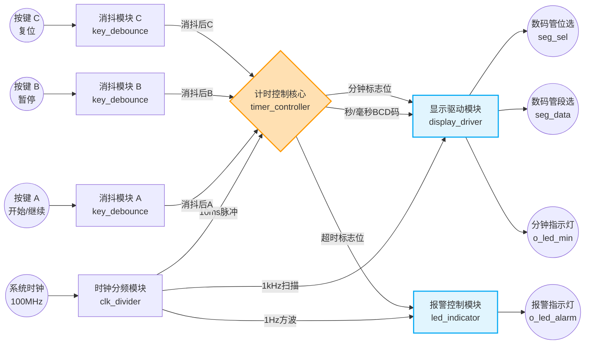

```mermaid

graph LR
    %% 输入引脚
    clk((系统时钟\n100MHz))
    key_a((按键 A\n开始/继续))
    key_b((按键 B\n暂停))
    key_c((按键 C\n复位))

    %% 内部模块
    Div[时钟分频模块\nclk_divider]
    DebA[消抖模块 A\nkey_debounce]
    DebB[消抖模块 B\nkey_debounce]
    DebC[消抖模块 C\nkey_debounce]
    Ctrl{计时控制核心\ntimer_controller}
    Disp[显示驱动模块\ndisplay_driver]
    Led[报警控制模块\nled_indicator]

    %% 输出引脚
    seg_sel((数码管位选\nseg_sel))
    seg_data((数码管段选\nseg_data))
    min_led((分钟指示灯\no_led_min))
    alarm_led((报警指示灯\no_led_alarm))

    %% 连接关系 - 时钟
    clk --> Div
    Div -- 10ms脉冲 --> Ctrl
    Div -- 1kHz扫描 --> Disp
    Div -- 1Hz方波 --> Led

    %% 连接关系 - 按键
    key_a --> DebA -- 消抖后A --> Ctrl
    key_b --> DebB -- 消抖后B --> Ctrl
    key_c --> DebC -- 消抖后C --> Ctrl

    %% 连接关系 - 核心数据
    Ctrl -- 秒/毫秒BCD码 --> Disp
    Ctrl -- 分钟标志位 --> Disp
    Ctrl -- 超时标志位 --> Led

    %% 连接关系 - 输出
    Disp --> seg_sel
    Disp --> seg_data
    Disp --> min_led
    Led --> alarm_led
    
    %% 样式美化 (加了分号防止VS Code注入标签报错)
    style Ctrl fill:#ffe0b2,stroke:#ff9800,stroke-width:2px;
    style Disp fill:#e1f5fe,stroke:#03a9f4,stroke-width:2px;
    style Led fill:#e1f5fe,stroke:#03a9f4,stroke-width:2px;

```